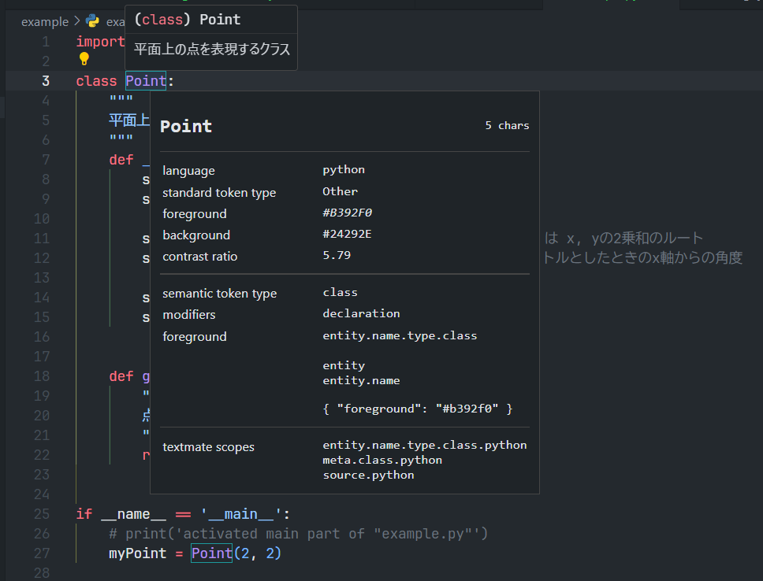

## 想定読者
- VSCodeのコードハイライトに不満がある人
- カラーテーマを自由にカスタマイズしたい人

## はじめに
VSCodeをお使いのみなさんはコードハイライトには毎日お世話になっているでしょう。
しかし、ときには「クラスとモジュールの色を同じにしないでくれよ」とか「コメントアウトはもっと目立たない色がいいな」といった不満を抱えることもあるでしょう。

私がこのように思うものの一つとしてPythonのDocstringがあります。
Docstringはクラスやメソッドに付ける説明文のようなものでコメントに近い性格のものですが、VSCodeの多くのカラーテーマではstr型の文字列と同じ色で表現されてしまうのです。
たとえば私の愛用する GitHub Dark テーマでは以下のように、コメントアウトはグレーの文字色なのに対し、Docstringと文字列リテラルは同じ水色で表示されています。

今回はコードハイライトを自由に設定する方法の例として、PythonのDocstringをコメントアウトと同じグレーに変えていく方法を紹介します。


## 文字色はどのように管理されているのか
コマンドパレットから `Developer: Generate Color Theme From Current Settings` を選択することで、
現在のVSCode上のすべてのカラー設定を確認することができます。


新たに開いたファイルの下の方へ行くと `tokenColors` というブロックがあります。
この中に `scope` というkeyとそれに対応するカラーコードが記載されています。
どうやらVSCodeが構文解析を行い、たとえばそれが `comment` であれば 文字色を `#6A737D` に、 `constant` なら `#79B8FF` にする
といった風に管理されているようです。

つまり、DocstringのセグメントがVSCode上でどのようなscopeとして認識されているかがわかれば、今回の目的を果たせそうです。

```json: current theme
"tokenColors": [
  {
  	"scope": [
      "comment",
      "punctuation.definition.comment",
      "string.comment"
  	],
  	"settings": {
      "foreground": "#6A737D"
  	}
  },
  {
  	"scope": [
      "constant",
      "entity.name.constant",
      "variable.other.constant",
      "variable.other.enummember",
      "variable.language"
  	],
  	"settings": {
      "foreground": "#79B8FF"
  	}
  },
  {
  	"scope": [
      "entity",
      "entity.name"
  	],
  	"settings": {
      "foreground": "#B392F0"
  	}
  },
```


## コード上のscopeの確認
コマンドパレットから `Developer: Inspect Editor Tokens and Scopes` を選択しましょう。


その後エディタに戻って何か適当な箇所にカーソルを当ててみましょう。
すると、そのセグメントをエディタがどのように解釈しているかという情報を見ることができるはずです。

下の例では、 `Point` というのは class であり、この箇所は定義文であり、また `entity.name.type.class.python` などのscopeを持つ、といった情報が確認できます。

さらに、forgeground から文字色も確認することができます。
一気に目当ての情報に近づくことができましたね。



## ユーザー設定を書き換える
カラーテーマのようなエディタ全体の設定は `settings.json` で定義するユーザー設定でオーバーライドできます。

Docstrings部分のscopeを調べると以下のようになっていることがわかります。
```text:Docstringsのscope
string.quoted.docstring.multi.python
source.python
```
これを参考にして、`settings.json` に以下を追記しましょう。

```json:settings.json
// color theme
"editor.tokenColorCustomizations": {
  "textMateRules": [
    {
      "scope": [
        "string.quoted.docstring",
      ],
      "settings": {
        "foreground": "#6A737D",
      }
    }
  ],
},
```
すると、、、あれ？
Docstringの文の部分は色が変わりましたが、前後のクォーテーションがまだ変わっていませんね。


クォーテーションについてもscopeを調べてみましょう。文の前後で `begin` `end` の違いはありますが以下のようになっているでしょう。
```text:Docstringの前クォーテーションのscope
punctuation.definition.string.begin.python
string.quoted.docstring.multi.python
source.python
```

ここで注意したいことは、`punctuation.definition.string` はDocstringと文字列リテラルの両方のクォーテーションに共通して与えられているscopeだということです（文字列リテラルのクォーテーションのscopeを調べてみてください）。つまり、これを指定して色を変えてしまうと今度は文字列リテラルに付いているクォーテーションの色までグレーになってしまうということです。

いま色を変えたいのはDocstringに関連するクォーテーションだけですので、2つのscopeをand条件で指定してみましょう。
複数のscopeを半角スペース区切りで列挙することでand条件で指定したことになります。
このとき、優先度が低いもの、すなわちより下の位置に記載されているものから順番に記載するように注意しましょう。

先ほどのscopeに `"string.quoted.docstring punctuation.definition.string"` を追加して以下のようにしましょう。ついでにイタリック体になんかしちゃいましょうか。
```json:settings.json
// color theme
"editor.tokenColorCustomizations": {
  "textMateRules": [
    {
      "scope": [
        "string.quoted.docstring",
        "string.quoted.docstring punctuation.definition.string"
      ],
      "settings": {
        "foreground": "#6A737D",
        "fontStyle": "italic"
      }
    }
  ],
},
```

ようやく求めていたカラーリングにすることができました！
Docstring部分はコメントアウトと同じグレーになりつつも、文字列リテラルは元の水色のままになっています。


## さいごに
今回はPythonのDocstringを例にしてVSCodeのセグメントを自由に色変えする方法を紹介しました。
ほかの言語でも同じように設定することができます。
色を減らしたい人、増やしたい人、それぞれ参考にしてみてください。

### 余談
Docstringをコメントアウトと同じ色にしてみたものの、実際にやってみるとこれは少し物足りないなと思いました。
